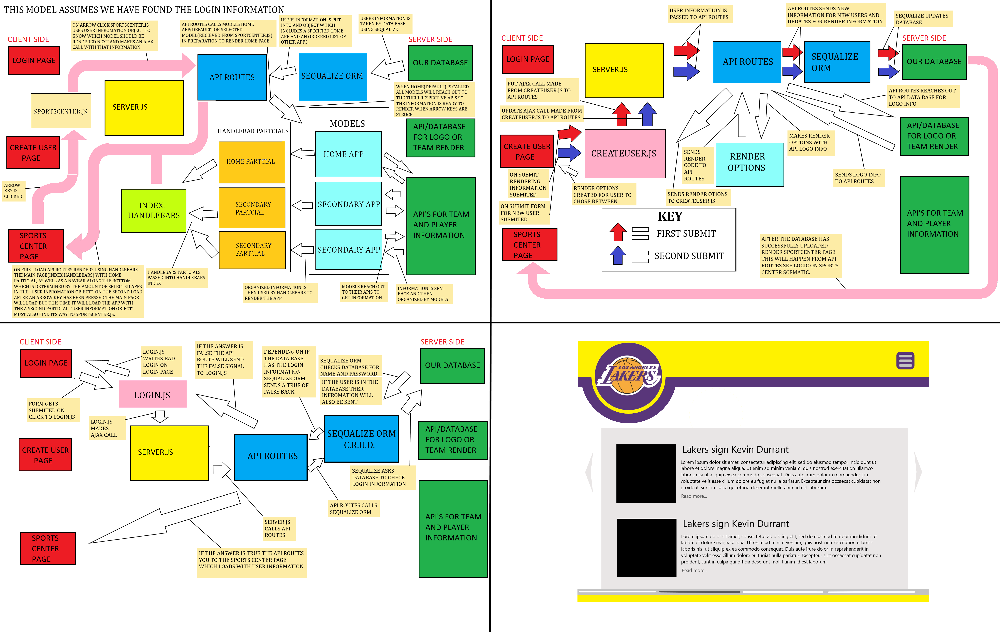
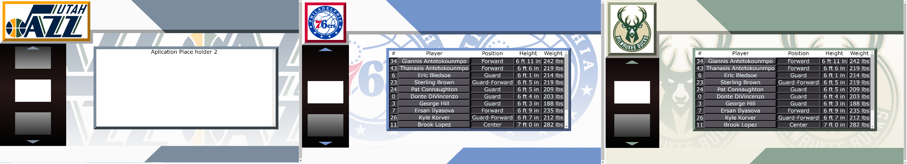
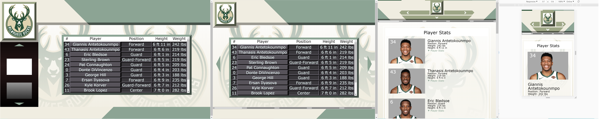

# NBASportsCenter Desktop(mobile friendly) Dashboard NBA Fan Experience

## Table of Contents

* Application Use
* Technology Used
* Details of the Applicaiton and Challenges
* List of future developments/features
* Link to the Live Project on Heroku
* Screenshots

## Application Use
The intention here was to create a sports-center onestop dashboard for following you favorite NBA team. Users enter their favorite team and favorite player which are saved to a mySQL data base using sequalize. The user is then directed to the login in page where they can login user there new name and password. The strength of the site is it's versatility. I envisioned this being used by someone at work open in a extra tab, often the largre screens we utalize in the office destroy the design experience of a website, because it was not design for the giant screens that are so common place now days. The site works on mobile devices as well, though it is simplified for better user experience.

## Technology Used

* [Node js](https://nodejs.org/en/)
* [Express js](https://expressjs.com/)
* [mySQL](https://www.mysql.com/)
* [Sequelize](https://sequelize.org/)
* [jpeg-js](https://www.npmjs.com/package/jpeg-js)
* [jquery](https://jquery.com/)
* [Axios](https://www.axios.com/)
* [Cheerio](https://www.npmjs.com/package/cheerio)

## API's Used
* [balldontlie](https://www.balldontlie.io/#introduction)
* [gnews](https://gnews.io/docs/v3#introduction)
* [imgur](https://api.imgur.com/)

## Details of the Application and Challenges
 NBA logos are not all the same size nor are they the same color. In order for the design to be pleasing visually to the user, color matching software was utalized as well as an image measuring system I designed that adjusts the size and placement of the websites elements to work with different size ratios for team logos.  The site is also highly mobile responsive. 
  
   
 The site utalizes several api's to gather its information. When I first began the my API search I wanted an API that would give me all the players on a given team as well as their stats. This does not exist at least not for free. So I built one using Cherrio. When the site loads I scrap NBA.com for all the players names, numbers, mugshot, heights, weights and a player ID number that is used by there site. These are then displayed to the user in a table. If you click a players name the id number is used to access current stats information for each player. This scraping system can give you current stats and images for every player from every team in the NBA. It is important to me that this site only be used for academic purposes for this reason. 
   
    
 I am also Ultalizing A free balldontlie API. This particular API will get you the most recent played games from a specified team and their scores. this is good information but it is also sort of simple and lack luster, which is why I combined this Information with the Youtube API. When you open the site the balldontlie API is called and the recent games are then put through the youtube API which pulls up those particular highlight videos. 
  
    
Another API I am utalizing is the Gnews api. This api pulls up the most recent articles on you favorite player and your team. I noticed some times this API doesn't always have there images up from the most recent articles and I had to figure out how to have a place holder image. Found an interesting solution for that. .[https://bitsofco.de/styling-broken-images/]
     
    
Another Challenge I ran into was that since I used a scraper I didn't want to be making a ton of request while in testing. To fix this I created A filler system where you can indicate if you are using the product in develoment or production. If it is in dev mode the scraper won't run and filler information will be used instead. 
     
    
User preferences are adjustable. The preferences you can adjust as a user include color preferences, your username, postion, height and weight, and a personal iamge. I am utalizing the imgur API so users can upload personal images from there device to the site. I also have a fun little interactive bit where you can adjust the size and placement of the uploaded image. The entire site is colored by a 5 colors. the user can chose which colors go where, and save their unqiue personalized look to the data base.  
 
Video of Preferences: https://youtu.be/TY8pyQYdPSM

## List of future developments/features
* I would like to ge thte user preferences working on mobile currrently they are only available in desktop mode. 

* One more thing I need to add is a html to screen shot system to take screen shots of the apps for the largest screen version. I have utalized this technology in the past using react but and looking for a way to implement it with jquery. I think I may have to send the html back to the server and process it there. then send it through the imgur npm package and then send the imgur Urls up to the site. the end result will be the currently white naviagtional squares on the left will have images of the apps as well as a short description underneath to give direction to the navigator. This must be done in real time because the apps are all different colors and I rather not create a huge document of urls for each team. Which bring up another idea from the inception of this site, which was that it could be used for mulitple sports leauges.

### Link to the Live Project on Heroku: https://nbasportscenter.herokuapp.com/

 
## Screen Shots
These are mostly accurate I have alot of unnecessary detail, because this was my first full stack project and I was still getting the hang of client and server side communication. I also included a sketch of how I thought it should look in the begining. 

This is an image showing how the site adjusts to the size and colors of the NBA team logos.

This is an Image showing the mobile responsiveness of the site.
 
